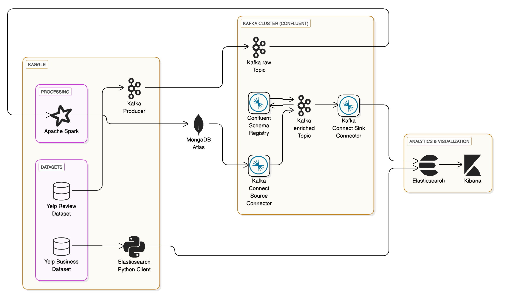

# Real-Time Data Streaming Pipeline with Kafka, Spark, and Elasticsearch

This repository showcases an end-to-end real-time data streaming pipeline using Apache Kafka, Apache Spark, MongoDB, Elasticsearch, and Kibana. The project demonstrates streaming, enriching, and visualizing data from the Yelp dataset.



## Project Architecture

The streaming pipeline consists of several interconnected components:

## Datasets
- Yelp Review Dataset: Streaming through Apache Kafka.
- Yelp Business Dataset: Loaded directly into Elasticsearch.

## Processing Layer
- Apache Spark: Processes real-time data streams from Kafka.
- MongoDB Atlas: Acts as intermediate storage for processed data.

## Kafka Cluster (Confluent)
- Kafka Producer: Publishes data to Kafka topics.
- Kafka raw topic: Initial storage of raw stream data.
- Kafka enriched topic: Stores enriched data after processing.
- Confluent Schema Registry: Manages schemas for Kafka data.
- Kafka Connect Source Connector: Reads enriched data from MongoDB.
- Kafka Connect Sink Connector: Writes enriched data to Elasticsearch.

## Analytics & Visualization
- Elasticsearch: Stores data for efficient querying and analytics.
- Kibana: Visualizes the data for insights.

## Additional Bulk Upload
- Elasticsearch Python Client: Performs bulk uploads from the Kaggle dataset into Elasticsearch.

## Notebooks Explained

### Kafka Producer Notebook
- Loads and publishes Yelp Review dataset to Kafka.
- Demonstrates setting up and streaming data through a Kafka Producer.

### Spark Stream Kafka to Mongo Notebook
- Consumes Kafka raw data streams.
- Performs real-time processing and enrichment using Apache Spark.
- Writes enriched data into MongoDB Atlas.

### Elasticsearch Bulk Upload Notebook
- Bulk loads Yelp Business dataset directly into Elasticsearch.
- Uses Python Elasticsearch client for efficient data indexing.

## Getting Started

### Prerequisites
- Apache Kafka (Confluent Platform)
- Apache Spark
- MongoDB Atlas
- Elasticsearch & Kibana
- Python 3.x

### Installation
Clone this repository:
```bash
git clone <repo-link>
cd kafka-streaming-pipeline
```

Install dependencies:
```bash
pip install -r requirements.txt
```

### Execution Steps
1. Start Kafka and ensure Confluent Schema Registry and Kafka Connectors are running.
2. Run the Kafka Producer Notebook to stream data.
3. Execute the Spark Streaming Notebook to process and store data.
4. Bulk upload additional datasets into Elasticsearch using the Elasticsearch Notebook.
5. Visualize the data using Kibana dashboards.

## Contributing
Contributions are welcome! Please create pull requests for enhancements or bug fixes.

## License
This project is licensed under the MIT License. See the [LICENSE](LICENSE) file for details.

